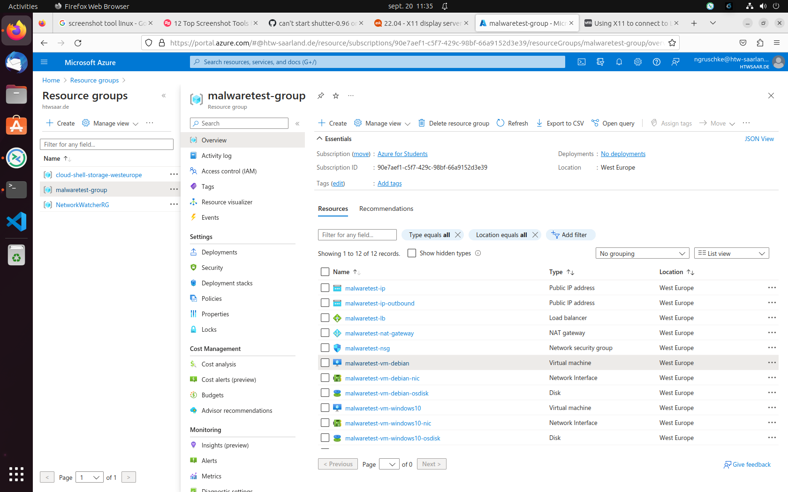
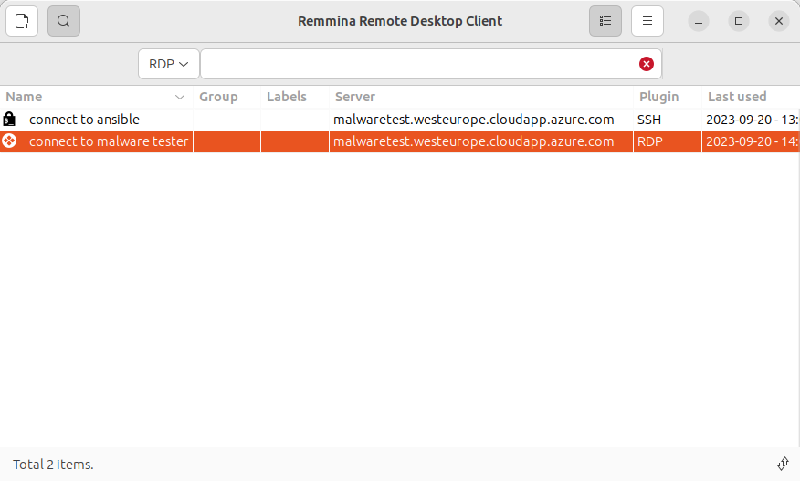
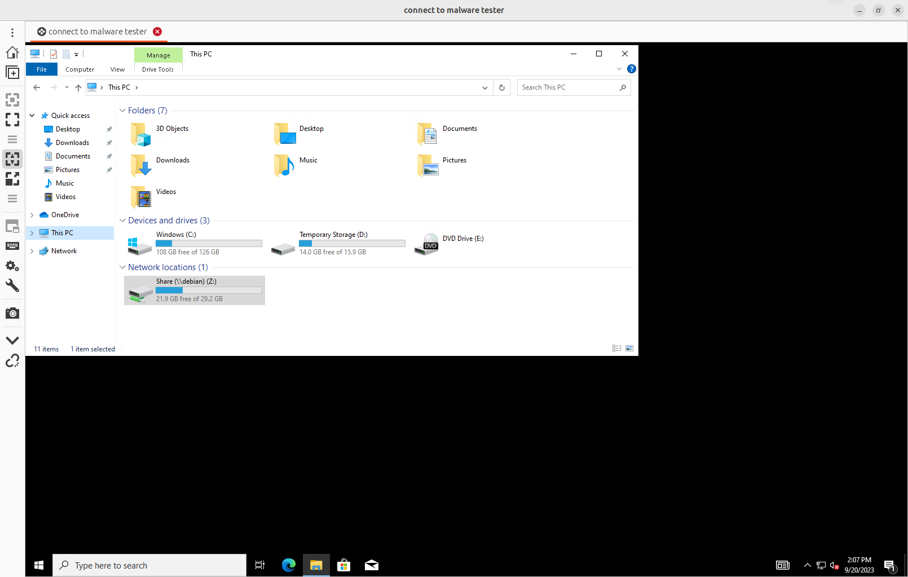
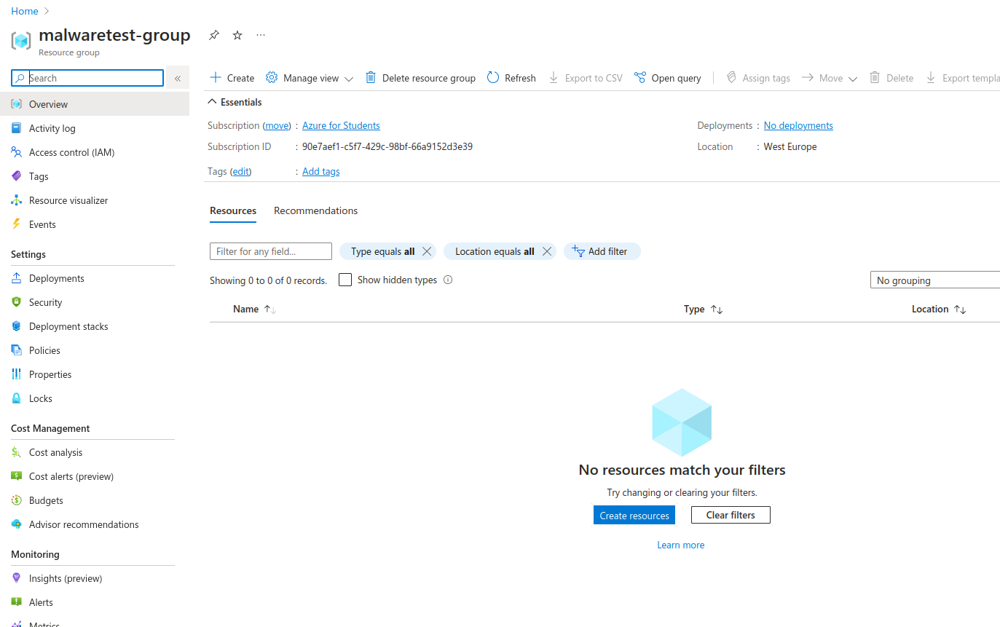

# malware test

this code will help you generate a azure cloud architecture with 2 machines one containing the malware library and the other the agent with a pre installed share and also the agent
you juste need to install it setup the policy to aggressive and try it

## prerequirement

- having a azure license
- having azure cloud on your machine and connected to your azure account
- rename the terraform.tfvars.template to terraform.tfvars
- add your IP to the **ip-whitelist** inside the *terraform.tfvars* file
- copy your agent in `ansible/roles/win10/files` and rename it edrinstaller.msi | edinstaller.exe
- go to `terraform/04 ansible` and comment out the line with ` --skip-tags "install_msi"` if you have an exe or `--skip-tags "install_exe"` if you have an msi.
- having a resource group named *malwaretest-group*

## creating the environment

for executing the terraform code you need to move to the folder *terrafrom*

execute the following commandes:
  - `terraform init` this will install the necessairy dependencies.

  - `terraform plan` this will plan the resources

  - `terraform apply` this will execute the plan, here you need to type `yes` when asked

after it was succesful it will prompt you the username of both machines and there passwords 
in case you forgote the password you can use `terraform output` to display it again

If you go to the azure page you will see the following

## executing the test

after the apply run successfully, you can copy the public-ip-dns value, this will be useful if you want to connect to the debian machine or/and to the windows machine.

the port that are available are the port 22 to ssh to the debian machine and the port 3389 to RDP to the windows machine. 
Since you added your public IP to the whitelist it can only be done from a machine in your network.

if you ssh to debian machine, after inserting the password you have to `sudo su` and then to `cd /usr/share/theZoo` to see all the malware which will be copied.

when you connect via RDP to the windows machine you will see the share in your explorer.

Here it can happen that the password is missing or the share is not available, to fix this issue with the password you only have to reenter it ( the password can be fount in the terraform output) with the user "*theZoo*". In case you cannot access it you just need to delete it and redo a mapping to the remote "**\\debian\Share**".

since the agent is install by defaut you juste need to check if it is correctly installed(some times you need to disable microsoft defender), and then to copy the content of the share to the windows PC and count how many files are remaining.

## destroy the environment

After you don't need the environment anymore like test finish or changing the installer you can run the command `terraform destroy --auto-approve` inside the Azure cloud console and all resources generated by terraform will be destroy. and it will look like this .

